# Main Street: Storylines

> **Canonical reference for the Main Street storyline (dual-choice incident
> chain) mechanic.** If this document and the code disagree, the code wins —
> and the discrepancy should be fixed by updating this document and the
> [doc-drift test](../../tests/main-street/storylines-doc-drift.test.ts).

---

## 1. Concepts

A **storyline** is a named, multi-step incident arc. A storyline incident
presents the player with an ordered list of **options**; each option decides
whether the incident's own effect applies and which card (if any) is queued
next. Storylines are how the game turns single incidents into recurring
threads the player can steer.

Key terms:

| Term | Meaning |
|------|---------|
| **Storyline id / title** | A stable grouping key (`storyline-tax`) and a display name (`Tax Troubles`). Descriptive metadata — it groups cards into an arc and drives the journal/HUD, but does **not** by itself make a card a choice. |
| **Choice card** | An incident that pauses resolution and asks the player to pick an option. Marked by `hasChoices=true`, or by a registered option list. |
| **Option** | `{ label, successorId, effectPolicy }` plus optional runtime callbacks `condition` / `successorResolver` (see §2.1). `effectPolicy` is `apply` (run the incident's effect) or `skip` (ignore it). `successorId` is the card queued next, or empty to end the chain. |
| **Successor / chain card** | The card pushed onto the incident deck when an option is chosen. |
| **Cycle** | A chain that returns to an earlier card. Cycles are a **first-class shape** (see §6). |
| **Pending choice** | `state.pendingEventChoice` — the drawn choice card awaiting a decision; the end-of-turn sequence is deferred until it resolves. |

The shipped game defines five storylines:

| Storyline id | Title | Choice cards |
|--------------|-------|--------------|
| `storyline-tax` | Tax Troubles | `evt-tax`, `evt-tax-error`, `evt-tax-inquiry` |
| `storyline-health` | Public Health Crisis | `evt-flu-outbreak` (→ `evt-pandemic`) |
| `storyline-economy` | Economic Downturn | `evt-recession` (→ `evt-depression`) |
| `storyline-labor` | Labour Unrest | `evt-strike-service` (→ `evt-general-strike`) |
| `storyline-restaurant` | Restaurant Renaissance | `evt-popular-menu` (→ `evt-farm-table`) |

### Player agency

Storylines are surfaced to the player through pure helpers in
[`src/MainStreetStorylineUi.ts`](../../src/MainStreetStorylineUi.ts) (unit-tested
without a browser):

- **Named dialog** — the choice dialog title is the storyline name
  (`choiceDialogTitle`, fallback: the card name) with the specific incident as
  a subtitle (`choiceDialogSubtitle`).
- **Outcome feedback** — resolving a choice writes a narrative “story update”
  line to the activity log, tied to the storyline (`storyUpdateLine`).
- **Continuity indicator** — a transient HUD label (`continuityIndicatorLabel`)
  names the storylines currently in play (`getActiveStorylines`): active while a
  card of the storyline is pending or queued, persisting through cycles, and
  cleared when the thread ends. The dialog appears instantly and the indicator
  is static text, so both are reduced-motion safe.
- **Journal & choice clarity** — a **Journal** HUD action opens an overlay
  listing past storyline choices and outcomes, most recent first, with an empty
  state before any choice (`buildJournal`/`journalIsEmpty` in
  [`src/MainStreetStorylineJournal.ts`](../../src/MainStreetStorylineJournal.ts)).
  The choice dialog also shows explanatory option labels describing the
  apply-vs-skip semantics without revealing the escalation card
  (`choiceClarityLabels`).

---

## 2. Data model and CSV columns

Choice/storyline data lives on `EventCard`
(`src/MainStreetCardsTypes.ts`) and is authored in
[`src/card-data.csv`](../../src/card-data.csv). Five optional columns drive the
mechanic (all default to empty = legacy behaviour):

| Column | Type | Description |
|--------|------|-------------|
| `hasChoices` | boolean (`true`/empty) | When `true`, the incident pauses and asks for an option. Only the literal string `true` (case-insensitive) is accepted. |
| `acceptNextCardId` | string | Card pushed when the **Accept** option (option 0, effect policy `apply`) is chosen. Empty ends the chain. |
| `rejectNextCardId` | string | Card pushed when the **Reject** option (option 1, effect policy `skip`) is chosen. Empty ends the chain. |
| `storylineId` | string | Storyline grouping key. Descriptive (journal/HUD). |
| `storylineTitle` | string | Storyline display name; falls back to the card name when empty. |

These are appended to the shared header, so `src/README.md`'s
[CSV column reference](../../src/README.md#csv-column-reference) lists them too.

### The generalised option model

Internally the legacy fields compile to an ordered option list
(`StorylineOption`):

```ts
// hasChoices=true + accept/reject links compile to exactly:
[
  { label: 'Accept', successorId: acceptNextCardId, effectPolicy: 'apply' },
  { label: 'Reject', successorId: rejectNextCardId, effectPolicy: 'skip' },
]
```

Plain (non-choice) cards compile to an empty list. The compilation is
**byte-for-byte behaviour-preserving**: a legacy card resolves exactly as it did
before the option model existed (pinned by the C1 regression harness and the
legacy-equivalence tests).

Multi-way storylines (>2 options) can be declared programmatically via
`registerStorylineOptions(eventId, options)` in
[`src/MainStreetStoryline.ts`](../../src/MainStreetStoryline.ts); explicit
options take precedence over the legacy compilation. Authoring new options via
CSV keeps to the two-way Accept/Reject shape today.

### 2.1 Callback escape hatch

Some narrative logic cannot be expressed with field/op/value predicates
(derived values, card-history checks, compound predicates). Each
`StorylineOption` therefore accepts two optional **runtime-only** callbacks:

```ts
interface StorylineOption {
  // …label, successorId, effectPolicy…
  readonly condition?: (state: MainStreetState) => boolean;
  readonly successorResolver?: (state: MainStreetState) => string | null | undefined;
}
```

- **`condition` — evaluated at draw time.** When the option list is compiled
  (the player is presented with the choice), each option's `condition` is
  called against the live state. Returning `false` omits the option from the
  presented list; `true` (or no condition) keeps it. Once the list is
  presented it is **frozen**: mutating state between draw and resolution does
  not re-evaluate conditions.
- **`successorResolver` — evaluated at resolution time.** When the chosen
  option has a `successorResolver`, it is invoked as the option resolves (after
  `effectPolicy` is applied) and its return value replaces `option.successorId`
  as the pushed successor. Returning `null` or `undefined` ends the chain.
  When absent, the declarative `successorId` is used unchanged.

**Contract (read-only, pure).** Both callbacks are typed as pure functions
over `MainStreetState`. They must not mutate state or perform side effects;
mutating state inside a callback is undefined behaviour. The callback type is a
thin abstraction over a state shape that a future core engine can match, so the
game-agnostic seam is preserved — no Main Street internals are baked into the
callback signature.

**Not serialisable.** Callbacks are registered programmatically via
`registerStorylineOptions`; they are never authored in CSV or the
manifest/schema, and are invisible to the validator and graph export. A
callback-equipped option with no `condition` behaves exactly like a legacy
option (backward compatible).

```ts
import { registerStorylineOptions } from './MainStreetStoryline';

registerStorylineOptions('evt-nationalise', [
  {
    label: 'Nationalise',
    successorId: 'evt-nationalise-fallout',
    effectPolicy: 'apply',
    // Only offered when the player previously took the state-led path.
    condition: (s) => s.resourceBank.coins > 1000 || s.turn > 12,
    // Resolution depends on runtime state that cannot be captured declaratively.
    successorResolver: (s) =>
      s.resourceBank.reputation > 50 ? 'evt-nationalise-win' : null,
  },
  { label: 'Decline', successorId: null, effectPolicy: 'skip' },
]);
```

The AI path needs no changes: `decideEventChoice` selects from the presented
option list, which `condition` has already filtered at draw time.

---

## 3. Resolution lifecycle

1. **Draw** — `resolveIncident` (`src/MainStreetEngineTurnClosing.ts`) draws
   the next incident. If the card presents a choice
   (`eventHasStoryline(event)` — `hasChoices` or registered options), the effect
   is **deferred**: the card becomes `state.pendingEventChoice`
   (`{ event, chosenOption: null, resolved: false }`), nothing is applied, and
   `resolveIncident` returns `null`.
2. **Pause** — `processEndOfTurn` sees an unresolved pending choice and returns
   `TurnResult.choicePending = true` before the income phase/EndCheck, so the
   UI can show the option dialog.
3. **Resolve** — `resolveEventOption(state, optionIndex)` looks up the option,
   applies or skips the incident's effect per `effectPolicy`, pushes the
   successor card (if any) onto the incident deck, records an `event-choice`
   transcript entry, and marks the pending choice resolved.
   `resolveEventChoice(state, 'accept' | 'reject')` is the backward-compatible
   wrapper over option index 0/1.
4. **Finish** — `finishDeferredEndOfTurn` consumes the resolved pending choice
   (clears it) and runs the remaining closing phases (EndCheck → next week).

```
resolveIncident ──(choice card)──▶ pendingEventChoice ──▶ processEndOfTurn pauses
        │                                                       │
        └──(plain card)──▶ apply effect, continue               ▼
                                             resolveEventChoice / resolveEventOption
                                                         │
                                            apply/skip + push successor
                                                         │
                                            finishDeferredEndOfTurn
```

**Deterministic deck insertion.** `pushChainCard` serialises successor
instances deterministically (`<base>-<n>`, next free serial across the incident
deck, event deck and discards). No RNG or wall-clock is consumed, so replay and
Monte Carlo remain deterministic.

**Undo/redo.** `resolveEventChoiceCommand` (from `MainStreetCommands.ts`) is a
snapshot-based command: undo restores the unresolved pending state (escalation
removed, resources restored), redo re-applies.

**Save/load.** `pendingEventChoice` is serialised (`MainStreetStateSerialize.ts`)
so an unresolved choice survives a save. Legacy saves without the field load
with `pendingEventChoice = null`. `chosenOption` is `string | null` — legacy
legacy choices store the lowercase `'accept'`/`'reject'` tokens.

**Transcript.** Each resolution records
`{ type: 'event-choice', turn, eventId, cardName, option, acceptNextCardId,
rejectNextCardId }`. The shape is identical for player and AI.

---

## 4. AI policy

Headless turns never stall: `resolveAiEventChoice` (re-exported from
`MainStreetAiStrategy.ts`, implemented via `resolvePendingEventChoice`) resolves
a pending choice by difficulty and completes the deferred closing.

`decideEventChoice(state, event, difficulty)`:

| Difficulty | Policy |
|------------|--------|
| **Easy** | Always accept. |
| **Medium** | Accept when the effect leaves coins > 0 after projecting the delta; otherwise reject. |
| **Hard** | Static full-chain evaluation: compare the current cost + accept-chain severity against the reject-chain severity; prefer the cheaper path, and avoid bankrupting accept paths. |

AI resolutions produce the same `event-choice` transcript entry as a player
choice, so replays are comparable.

---

## 5. Tooling

All scripts run under `vite-node` because the card model imports
`card-data.csv` through Vite's `?raw` query.

| Command | Purpose |
|---------|---------|
| `npm run validate:storylines` | Validate the shipped graph. Exits `0` when valid, `1` on a dangling link, unknown target, duplicate id, invalid option. Flags: `--json`, `--csv <path>`, `--fail-on-cycle`. |
| `npm run storylines:graph -- --format mermaid` | Regenerate `docs/main-street/storyline-graph.mmd` (choice cards as diamonds, `==>` for cycle edges). |
| `npm run storylines:graph -- --format json` | Regenerate `docs/main-street/storyline-manifest.json` (validates against `schemas/main-street-storyline.schema.json`). |
| `npm run storylines:graph -- --format json --check` | Drift guard: exit `1` when the committed artefact differs from `src/card-data.csv`. |
| `npm run storylines:graph:svg` | Render the committed `storyline-graph.mmd` into `docs/main-street/storyline-graph.svg` (portable — viewable without a Mermaid renderer). |
| `npm run storylines:graph:svg -- --check` | Drift guard: exit `1` when the committed SVG differs from a re-render of the committed `.mmd`. |
| `npm run storylines:author -- add-card …` | Safely append a card (validated before writing). |
| `npm run storylines:author -- link …` | Set choice links / storyline metadata on an existing card (validated before writing). |

**Cycle policy.** The validator reports cycles as **informational** findings
(`RESULT: VALID`, exit `0`); pass `--fail-on-cycle` to treat them as errors. The
shipped tax chain is an intentional cycle.

**Opt-in pre-push reminder.** `sh src/scripts/install-storylines-pre-push.sh`
installs a **non-blocking** local pre-push reminder that runs the validator; it
never blocks an unrelated push and is not installed automatically. Remove it
with `--remove`.

---

## 6. Cycles are a first-class shape

Cycles are intentional (producer decision, 2026-09-29) and must not fail
validation:

- **Validator** — reports each cycle once as an informational finding.
- **Graph/manifest** — marks participating edges `cycle: true`; Mermaid renders
  them with `==>`.
- **Continuity** — the player-agency indicator (C7) persists while a cycle is
  live.
- **Tests** — the shipped tax cycle is pinned structurally (`chain-content`),
  behaviourally (C1 harness), and in the manifest (`storyline-graph`).

---

## 7. Authoring walkthrough

This is the complete, copy-pasteable workflow. It matches the shipped tooling.

### 7.1 Declare a storyline and add a choice card

```sh
# 1. Add the first card of a new storyline, with a choice:
npm run storylines:author -- add-card \
  --id evt-river-festival --name "River Festival" \
  --effect "Lose 150 coins staging the festival" --coin-delta -150 \
  --has-choices --accept-next evt-good-press --reject-next evt-noise-complaint \
  --storyline-id storyline-festival --storyline-title "Festival Season"

# 2. Add the escalation cards (plain incidents — they resolve normally):
npm run storylines:author -- add-card \
  --id evt-river-flood --name "River Flood" \
  --effect "Lose 500 coins repairing flood damage" --coin-delta -500 \
  --storyline-id storyline-festival --storyline-title "Festival Season"

# 3. Link an existing card into the storyline (optional):
npm run storylines:author -- link --id evt-award \
  --storyline-id storyline-festival --storyline-title "Festival Season"

# 4. Validate (the author command already validates before writing):
npm run validate:storylines

# 5. Regenerate the committed graph + manifest:
npm run storylines:graph -- --format mermaid
npm run storylines:graph -- --format json
```

`add-card` / `link` build the edited CSV in memory, load it through the typed
model and run the validator **before** any write. If the result is invalid the
command exits non-zero, prints the offending card/link, and leaves the CSV
untouched. Add `--dry-run` to validate without writing, or `--csv <path>` to
edit a fixture.

### 7.2 The shipped graph (documented chains)



The image above is rendered from [`storyline-graph.mmd`](./storyline-graph.mmd) by
`npm run storylines:graph:svg` and committed, so the graph is viewable without a
Mermaid-aware renderer. Regenerate it whenever the `.mmd` changes (the SVG
drift test fails otherwise).

The doc-drift test parses the table below and compares it to
`src/card-data.csv`. Keep it in sync with the shipped content.

| Card id | Card name | Storyline | Accept next | Reject next |
|---------|-----------|-----------|-------------|-------------|
| `evt-tax` | Tax Audit | storyline-tax | — | `evt-tax-inquiry` |
| `evt-tax-error` | Error in Tax Return | storyline-tax | — | `evt-tax` |
| `evt-tax-inquiry` | Inquiry Commission | storyline-tax | `evt-tax-error` | — |
| `evt-flu-outbreak` | Flu Outbreak | storyline-health | — | `evt-pandemic` |
| `evt-recession` | Economic Recession | storyline-economy | — | `evt-depression` |
| `evt-strike-service` | Service Workers Strike | storyline-labor | — | `evt-general-strike` |
| `evt-popular-menu` | Popular Menu Item | storyline-restaurant | — | `evt-farm-table` |

Terminal escalation cards (`evt-pandemic`, `evt-depression`,
`evt-general-strike`, `evt-farm-table`) carry a storyline id for grouping but
are **plain incidents** — they resolve normally when drawn.

---

## 8. Authoring checklist

Before committing a storyline change:

- [ ] **Ids are unique** and use the `evt-` prefix (`validate:storylines` fails on duplicates).
- [ ] **Links resolve** — every `acceptNextCardId`/`rejectNextCardId` names an existing card.
- [ ] **Choice cards set `hasChoices`** (the author helper does this automatically when you set a link).
- [ ] **Storyline metadata** — choice cards and their escalations share a `storylineId`; the first card sets a `storylineTitle`.
- [ ] **Effects are intentional** — `apply` (`acceptNextCardId`) applies the incident effect; `skip` (`rejectNextCardId`) does not.
- [ ] **Cycles are intentional** — a cycle is allowed, but confirm it is a designed recurring thread.
- [ ] **`npm run validate:storylines` exits 0.**
- [ ] **`npm run storylines:graph -- --format mermaid` and `--format json` are regenerated and committed** (the drift test fails otherwise).
- [ ] **`npm run storylines:graph:svg` is regenerated and committed** when the graph changes (the SVG drift test fails otherwise).
- [ ] **Balance** — run the Monte Carlo guardrail (`npm test`) if the change alters economy-affecting effects.
- [ ] **Tests** — add/extend unit tests; the C1 regression harness must stay green.

---

## 9. Core-engine extraction path

The mechanic is Main-Street-specific today but sits behind a deliberately
**game-agnostic seam** so it can move to the core engine later (producer
decision, 2026-09-29: Main Street-specific now, designed to move).

**The seam** is [`src/MainStreetStoryline.ts`](../../src/MainStreetStoryline.ts):

- `compileStorylineFromEvent(event)` / `getStorylineOptions(event)` — pure, no state.
- `registerStorylineOptions` / `resetStorylineRegistry` — the option registry.
- `createPendingStorylineChoice(event)` — builds the pending state.
- `resolveStorylineOption(state, event, option)` — applies `effectPolicy`, pushes the successor.
- `pushChainCard(state, templateId)` — deterministic deck insertion.
- `markChoiceResolved` / `recordStorylineResolution`.

Callers (engine, UI, scripts) never reach into Main-Street-only resolution
internals: they go through these functions, and the generalised engine entry
point `resolveEventOption(state, optionIndex)`.

**Migration notes (from C2):**

- The option list is a **linear ordered sequence**; resolution selects one
  option by index. There is no branching graph traversal.
- `compileStorylineFromEvent` is the sole compilation entry point. It accepts
  an optional `state` argument; when supplied, options whose `condition`
  callback returns `false` are omitted from the compiled list (draw-time
  filtering). `getStorylineOptions(event, state)` threads the same argument
  through.
- `resolveStorylineOption` applies the effect policy, then resolves the
  successor — preferring `option.successorResolver(state)` when present and
  falling back to `option.successorId`; the **caller** pushes it.
- **Callback type contract:** `condition` / `successorResolver` are pure,
  read-only functions over `MainStreetState`. They carry no Main Street
  internals beyond the public state shape, so a future core engine can match
  the signature. They are runtime-only — never serialised, never validated,
  never exported to the graph.
- The seam depends only on a state shape and a template registry supplied by the
  caller — no Main Street globals are baked in.
- Portability caveat: `pushChainCard` currently uses the Main Street template
  registry (`getEventTemplates`); a core move would inject that registry.

---

## 10. Roadmap

Prioritised further work, deliberately deferred from the write-storylines epic.
Each is captured as a work item:

| Priority | Idea | Work item |
|----------|------|-----------|
| Medium | Storyline coverage analytics in the Monte Carlo harness (firing frequency, chain depth, cycle counts, choice win-rate impact). | `MS-0MUNB4ZXQ0081EX7` |
| Done | Render the committed Mermaid graph to SVG in the docs build and link it here. Delivered by `MS-0MUNB54KU005084C` (see §7.2). | `MS-0MUNB54KU005084C` |
| Low | Extend options with conditional/cost-gated effects (`StorylineOption` was designed to grow). | `MS-0MUNB58TK0025CB9` |
| Low | Callback escape hatch: arbitrary `condition` / `successorResolver` callbacks on storyline options. | `MS-0MUPORT1Z000QX8N` |
| Low | Visual storyline authoring editor backed by the manifest and the transactional author API. | `MS-0MUNB5D7K001GH19` |

---

## 11. Related documents

- [`src/README.md`](../../src/README.md) — CSV column reference (includes the storyline columns) and engine contracts.
- [`docs/main-street/content-design-and-progression.md`](./content-design-and-progression.md) — card inventory, economy and progression.
- [`docs/main-street/core-rules-and-mechanics.md`](./core-rules-and-mechanics.md) — turn structure and end-of-turn sequence.
- [`docs/main-street/ai-strategy.md`](./ai-strategy.md) — AI strategy overview.
- [`docs/main-street/storyline-graph.mmd`](./storyline-graph.mmd) — generated Mermaid graph (source of truth).
- [`docs/main-street/storyline-graph.svg`](./storyline-graph.svg) — rendered graph image (viewable without a Mermaid renderer).
- [`docs/main-street/storyline-manifest.json`](./storyline-manifest.json) — generated manifest.
- [`schemas/main-street-storyline.schema.json`](../../schemas/main-street-storyline.schema.json) — manifest JSON schema.
